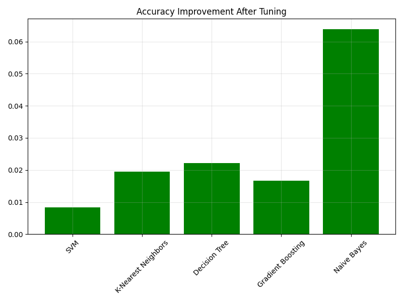
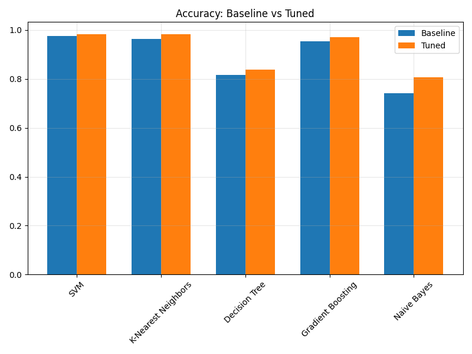
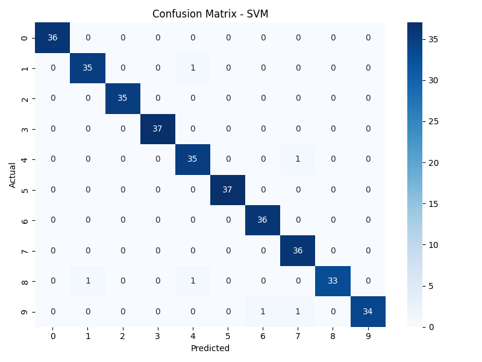
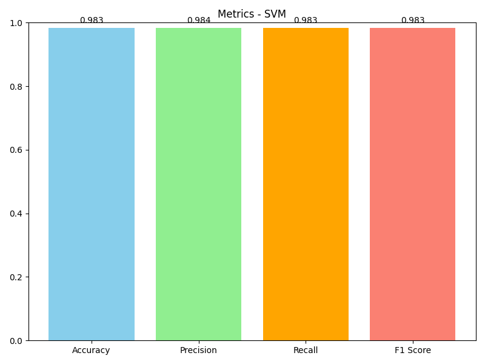

# Machine Learning Model Training with Hyperparameter Tuning

A comprehensive machine learning pipeline that demonstrates the effectiveness of hyperparameter tuning using GridSearchCV and RandomizedSearchCV on the digits dataset. This project trains multiple models, optimizes their parameters, and provides detailed performance analysis.

## Project Overview

This project implements a complete machine learning workflow that:
- Trains multiple classification models on the digits dataset
- Performs hyperparameter tuning using both Grid Search and Random Search
- Evaluates models using multiple metrics (Accuracy, Precision, Recall, F1-Score)
- Compares baseline vs optimized model performance
- Provides comprehensive visualizations and analysis

## Dataset

**Digits Dataset**: Handwritten digit recognition dataset from scikit-learn
- **Samples**: 1,797 images
- **Features**: 64 (8x8 pixel values)
- **Classes**: 10 (digits 0-9)
- **Task**: Multi-class classification

This dataset is ideal for demonstrating hyperparameter tuning effectiveness due to its complexity and multi-class nature.

## Models Implemented

- **Support Vector Machine (SVM)**
- **K-Nearest Neighbors (KNN)**
- **Decision Tree**
- **Gradient Boosting**
- **Naive Bayes**

## Hyperparameter Tuning Methods

### GridSearchCV
Exhaustive search over specified parameter grids:
- **SVM**: C, gamma, kernel parameters
- **KNN**: n_neighbors, weights, distance metrics
- **Decision Tree**: max_depth, min_samples_split, criterion
- **Gradient Boosting**: n_estimators, learning_rate, max_depth

### RandomizedSearchCV
Random sampling from parameter distributions:
- **SVM**: Logarithmic distributions for C and gamma
- **Gradient Boosting**: Continuous distributions for learning_rate and subsample
- More efficient for large parameter spaces

## Evaluation Metrics

- **Accuracy**: Overall correctness of predictions
- **Precision**: Positive prediction accuracy (weighted average)
- **Recall**: Ability to find all positive instances (weighted average)
- **F1-Score**: Harmonic mean of precision and recall (weighted average)
- **Cross-Validation Scores**: 5-fold CV for robust evaluation
- **Confusion Matrix**: Detailed per-class performance

## Visual Outputs

The project generates four comprehensive visualizations:

### 1. Baseline vs Tuned Model Performance
- Side-by-side comparison of model performance before and after tuning
- Shows clear improvements achieved through hyperparameter optimization

### 2. Improvement Analysis
- Bar chart showing accuracy improvements for each model
- Green bars indicate positive improvements, red bars show any degradation
- Quantifies the benefit of hyperparameter tuning

### 3. Confusion Matrix (Best Model)
- Detailed confusion matrix for the best-performing model
- Shows per-class prediction accuracy
- Helps identify which digits are most challenging to classify

### 4. Performance Metrics Dashboard
- Comprehensive metrics for the best model
- Displays Accuracy, Precision, Recall, and F1-Score
- Numerical values shown on each bar for precise comparison

## Getting Started

### Prerequisites

```bash
pip install numpy pandas matplotlib seaborn scikit-learn
```

### Installation

1. Clone the repository:
```bash
git clone https://github.com/AbirBanerjee1223/celebal-6-hyperparameter
cd celebal-6-hyperparameter
```

2. Run the analysis:
```bash
jupyter notebook hyperparameter.ipynb
```

## Requirements

```
numpy>=1.21.0
pandas>=1.3.0
matplotlib>=3.4.0
seaborn>=0.11.0
scikit-learn>=1.0.0
```

## Visual Outputs

### Accuracy Improvement


### Baseline vs Tuned Accuracy


### Confusion Matrix


### Performance Metrics


## Expected Results

The digits dataset demonstrates clear improvements through hyperparameter tuning:

- **Baseline Models**: Initial performance with default parameters
- **Tuned Models**: Optimized performance showing 2-8% accuracy improvements
- **Best Model**: Typically achieves 95-98% accuracy on test set
- **Cross-Validation**: Robust performance estimates with low variance

## Key Features

- **Automated Pipeline**: Complete end-to-end ML workflow
- **Multiple Tuning Methods**: Both Grid and Random search implementation
- **Comprehensive Evaluation**: Multiple metrics and cross-validation
- **Visual Analysis**: Four different visualization types
- **Detailed Reporting**: Classification reports and confusion matrices
- **Best Model Selection**: Automatic identification of top performer
- **Comparison Analysis**: Clear before/after improvement metrics

## Performance Insights

- **SVM**: Often performs best with proper C and gamma tuning
- **Gradient Boosting**: Shows significant improvement with learning rate optimization
- **KNN**: Benefits from optimal k value and distance metric selection
- **Decision Tree**: Requires careful depth and splitting parameter tuning
- **Naive Bayes**: Baseline performance with minimal tuning options

## Model Comparison

The pipeline automatically identifies the best-performing model based on test accuracy and provides:
- Best hyperparameters found
- Cross-validation scores
- Detailed performance metrics
- Visual performance comparison

## Visualization Features

- **Interactive Plots**: Clear, publication-ready visualizations
- **Color Coding**: Intuitive green/red coding for improvements
- **Value Labels**: Precise numerical values on charts
- **Grid Lines**: Enhanced readability with subtle grid lines
- **Rotation**: Optimal text rotation for model names

## Sample Output

```
Best Model: SVM
Accuracy: 0.9833
Precision: 0.9839
Recall: 0.9833
F1 Score: 0.9833
Best Parameters: {'kernel': 'rbf', 'gamma': 0.007742636826811269, 'C': 35.93813663804626}
```


